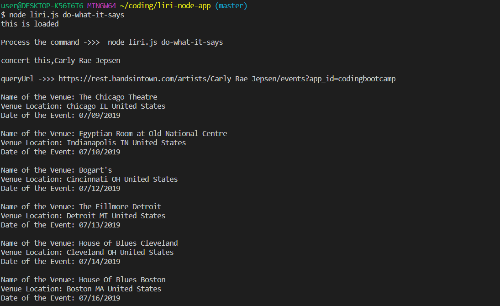
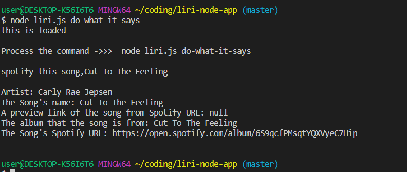
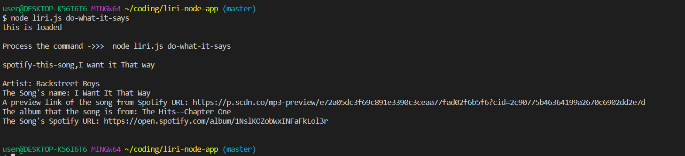
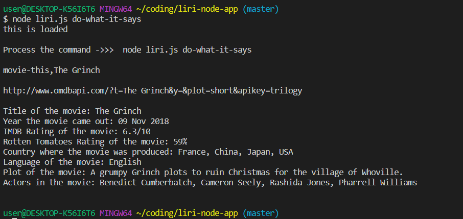
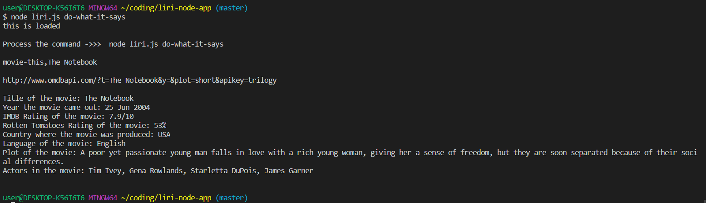
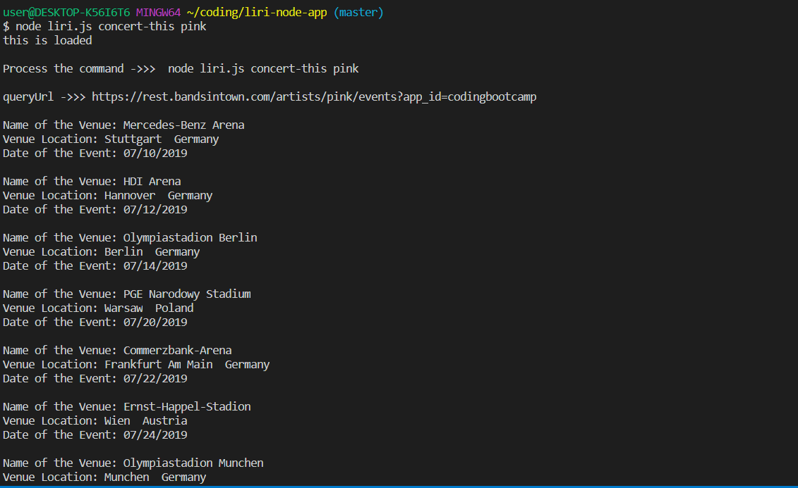
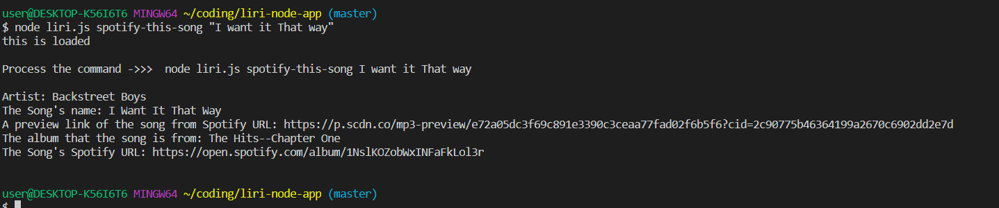
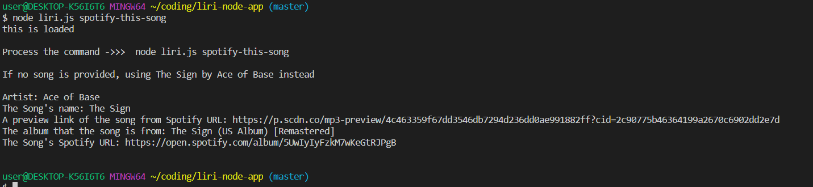
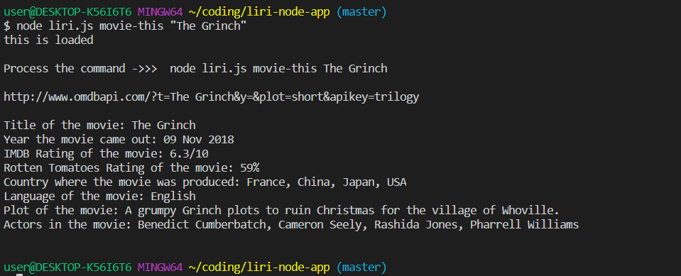
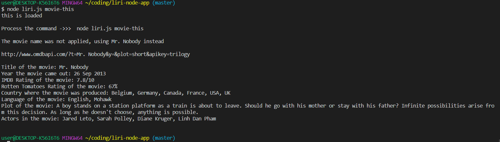

# liri-node-app
LIRI Bot
*   https://github.com/yzhouyzhou/liri-node-app
*   https://yzhouyzhou.github.io/liri-node-app/
*   The link was also added into my updated portfolio https://yzhouyzhou.github.io/Bootstrap-Portfolio/games.html
    LIRI Bot July 2 2019

*   LIRI Bot is a node server side project. It is to search spotify for songs, Bands in Town for concerts and OMDB for movies.

*   node liri.js do-what-it-says // for do-what-it-says, copy the following commands into random.txt
    *   concert-this,Carly Rae Jepsen
        
    *   spotify-this-song,Cut To The Feeling
        
    *   spotify-this-song,I want it That way
        
    *   movie-this,The Grinch
        
    *   movie-this,The Notebook
        

*   node liri.js concert-this pink
    
*   node liri.js spotify-this-song "I want it That way"
    
*   node liri.js spotify-this-song
    
*   node liri.js movie-this "The Grinch"
    
*   node liri.js movie-this
    
    

All the output are displayed in the console and written into log.txt

